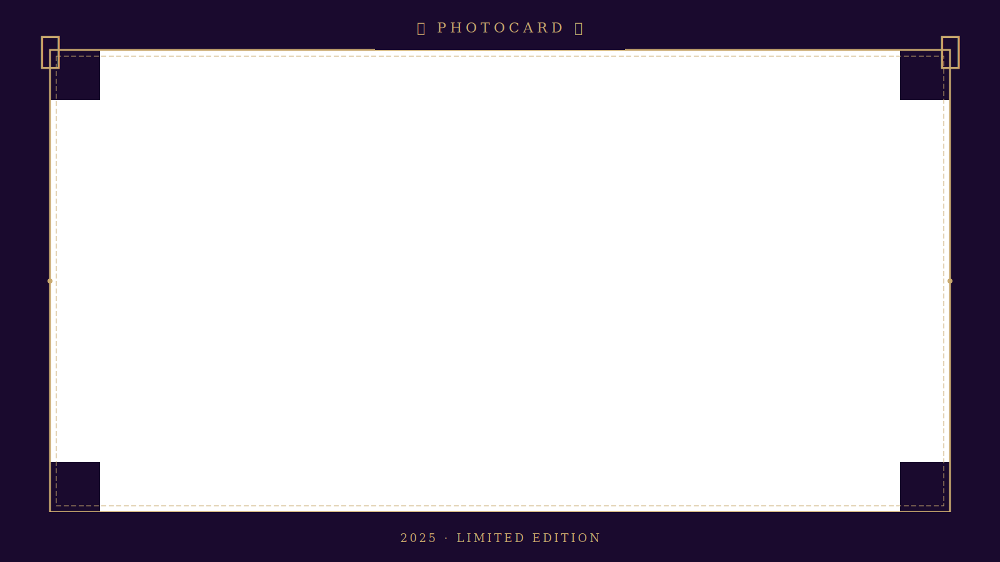

# 📸 Photocard Frame Maker

একটি সুন্দর, সম্পূর্ণ **client-side** photocard maker — কোনো server লাগবে না।  
GitHub Pages এ host করো, সবাই ব্যবহার করতে পারবে।

---

## 🗂️ Project Structure

```
photocard-app/
├── index.html      ← মূল app (এটাই সব)
├── frame.svg       ← তোমার photocard frame (replace করবে)
└── README.md       ← এই file
```

---

## 🚀 GitHub Pages এ Deploy করার পদ্ধতি

### Step 1 — Repository তৈরি করো
1. GitHub এ লগইন করো
2. **"New Repository"** ক্লিক করো
3. নাম দাও: `photocard` (বা যেকোনো নাম)
4. **Public** রাখো
5. **Create repository** ক্লিক করো

### Step 2 — Files upload করো
1. Repository পেজে **"uploading an existing file"** ক্লিক করো
2. `index.html` এবং `frame.svg` দুটো file drag করে upload করো
3. **Commit changes** ক্লিক করো

### Step 3 — GitHub Pages চালু করো
1. Repository এর **Settings** ট্যাবে যাও
2. বাম দিকে **"Pages"** ক্লিক করো
3. **Source:** `Deploy from a branch` সিলেক্ট করো
4. **Branch:** `main` → `/ (root)` সিলেক্ট করো
5. **Save** ক্লিক করো
6. ২-৩ মিনিট পর তোমার site live হবে:
   ```
   https://তোমার-username.github.io/photocard/
   ```

---

## 🖼️ তোমার আসল Frame বসানোর পদ্ধতি

```
frame.svg  →  এই file টা তোমার আসল frame দিয়ে replace করো
```

**যেকোনো format কাজ করবে:**
- `frame.svg` → SVG frame (recommended, best quality)
- অথবা `frame.png` → PNG frame (transparent background সহ)

**যদি PNG ব্যবহার করো:**  
`index.html` এ এই line টা খোঁজো এবং `.svg` → `.png` করো:
```html
frameImg.src = 'frame.svg';   <!-- এটা বদলে -->
frameImg.src = 'frame.png';   /* এটা করো */
```
এবং:
```html
    <!-- এটাও বদলাও -->

```

---

## ✨ Features

| Feature | Details |
|---------|---------|
| 📤 Photo Upload | Click বা Drag & Drop |
| 🖼️ Frame Overlay | তোমার frame user-এর ছবির উপরে বসে |
| 🔍 Scale Control | ছবি ছোট-বড় করা যায় |
| ↔️ Position Control | Horizontal & Vertical adjust |
| 📍 Quick Position | 9-point grid দিয়ে এক ক্লিকে position |
| 💾 Download | PNG format এ download |
| 📱 Responsive | Mobile ও desktop দুটোতেই কাজ করে |

---

## 🎨 Output Size

- Canvas: **1600 × 900 px** (16:9 Landscape)
- Format: **PNG** (high quality)
- Social media ready ✅

---

## 💡 Tips

- Frame টা transparent background সহ বানাও (PNG/SVG)
- Frame-এর center area transparent রাখো যেখানে ছবি দেখাবে
- ভালো result এর জন্য frame টা **1600×900 px** size এ বানাও

---

Made with ❤️ · GitHub Pages · No server needed
